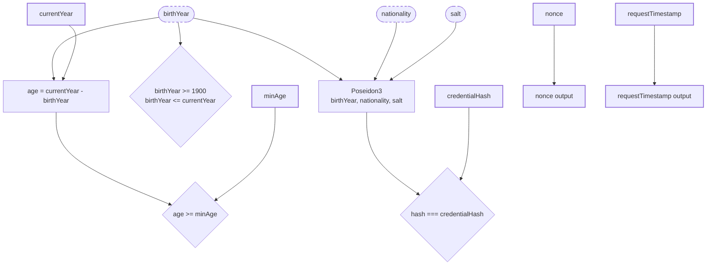
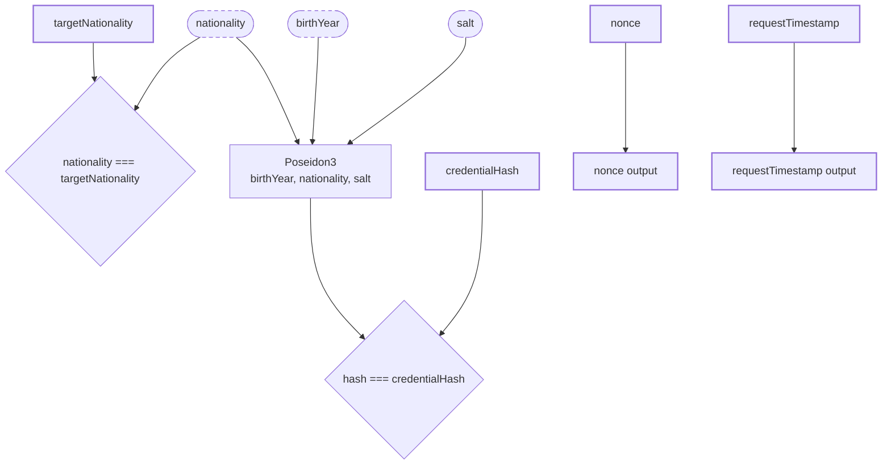
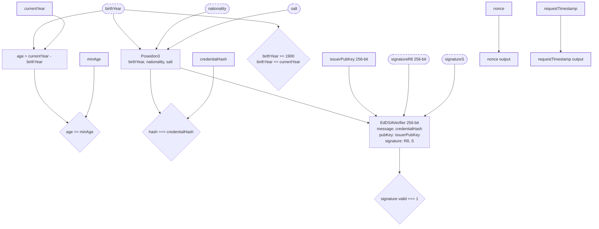
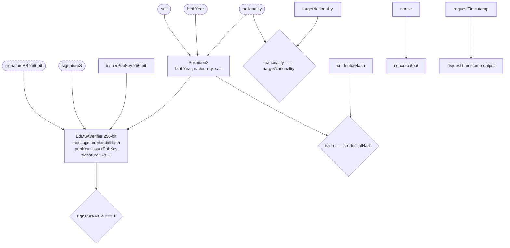
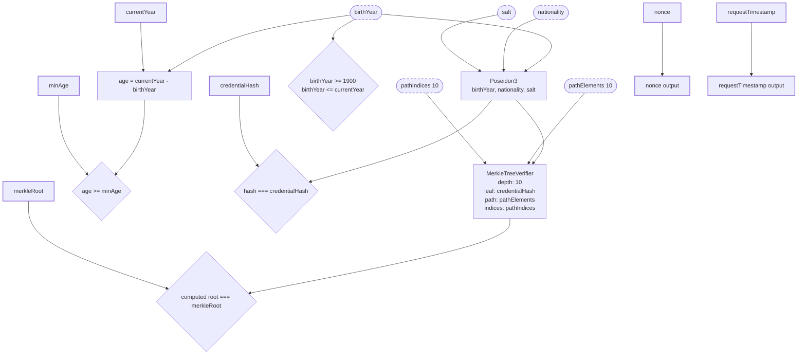
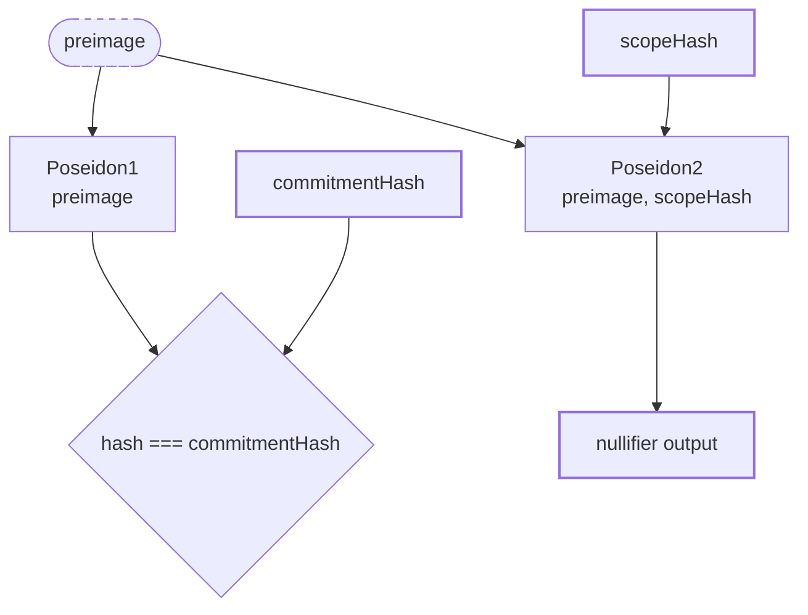
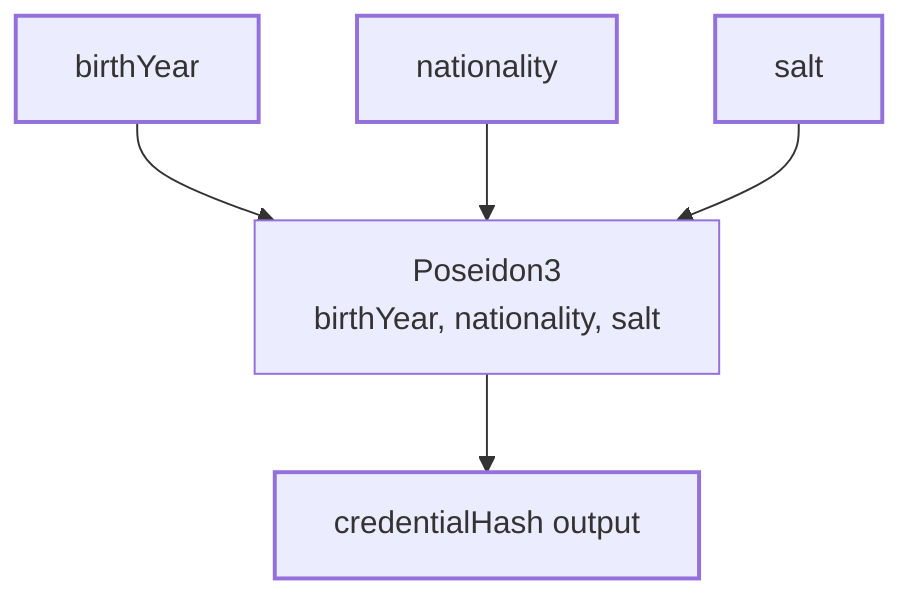

# Circuit Signal Flow Diagrams

**Version:** 1.0.0
**Date:** 2026-02-09

This document provides Mermaid signal flow diagrams for all zk-id circuits, showing input/output relationships and constraint enforcement.

---

## Legend

```
┌─────────────┐
│ Private     │  Dashed border = private input (witness, not public)
└─────────────┘

┌─────────────┐
│ Public      │  Solid border = public input/output
└─────────────┘

    Hash
   ┌────┐
───│    │───    Box = constraint component
   └────┘
```

---

## 1. age-verify.circom

**Purpose:** Prove age ≥ minAge without revealing birth year.

**Signals:**

- **Private:** `birthYear`, `nationality`, `salt`
- **Public:** `credentialHash`, `minAge`, `currentYear`, `nonce`, `requestTimestamp`



**Constraint count:** ~2,500 (see `docs/CIRCUIT-COMPLEXITY.md`)

**Key constraints:**

- `birthYear >= 1900` and `birthYear <= currentYear` (GreaterEqThan 12-bit)
- `age >= minAge` (GreaterEqThan 12-bit)
- `Poseidon(birthYear, nationality, salt) === credentialHash`

---

## 2. nationality-verify.circom

**Purpose:** Prove nationality matches target without revealing actual nationality.

**Signals:**

- **Private:** `birthYear`, `nationality`, `salt`
- **Public:** `credentialHash`, `targetNationality`, `nonce`, `requestTimestamp`



**Constraint count:** ~2,000

**Key constraints:**

- `nationality === targetNationality` (ForceEqualIfEnabled)
- `Poseidon(birthYear, nationality, salt) === credentialHash`

---

## 3. age-verify-signed.circom

**Purpose:** Prove age ≥ minAge with in-circuit EdDSA signature verification.

**Signals:**

- **Private:** `birthYear`, `nationality`, `salt`, `signatureR8[256]`, `signatureS`
- **Public:** `credentialHash`, `minAge`, `currentYear`, `nonce`, `requestTimestamp`, `issuerPubKey[256]`



**Constraint count:** ~18,000 (EdDSA adds ~15,500 constraints)

**Key constraints:**

- Age verification (same as age-verify.circom)
- `EdDSAVerifier(credentialHash, issuerPubKey, R8, S) === 1`
- Poseidon output (254-bit) fits in EdDSAVerifier's 256-bit message field

---

## 4. nationality-verify-signed.circom

**Purpose:** Prove nationality with in-circuit EdDSA signature verification.

**Signals:**

- **Private:** `birthYear`, `nationality`, `salt`, `signatureR8[256]`, `signatureS`
- **Public:** `credentialHash`, `targetNationality`, `nonce`, `requestTimestamp`, `issuerPubKey[256]`



**Constraint count:** ~17,500

**Key constraints:**

- Nationality verification (same as nationality-verify.circom)
- `EdDSAVerifier(credentialHash, issuerPubKey, R8, S) === 1`

---

## 5. age-verify-revocable.circom

**Purpose:** Prove age ≥ minAge with Merkle inclusion proof (credential not revoked).

**Signals:**

- **Private:** `birthYear`, `nationality`, `salt`, `pathElements[10]`, `pathIndices[10]`
- **Public:** `credentialHash`, `minAge`, `currentYear`, `nonce`, `requestTimestamp`, `merkleRoot`



**Constraint count:** ~4,000 (Merkle verifier adds ~1,500 constraints)

**Key constraints:**

- Age verification (same as age-verify.circom)
- `MerkleTreeVerifier(credentialHash, pathElements, pathIndices) === merkleRoot`
- Depth hardcoded to 10 → max 1,024 valid credentials

---

## 6. nullifier.circom

**Purpose:** Compute deterministic nullifier for sybil-resistance.

**Signals:**

- **Private:** `preimage` (credential commitment hash)
- **Public:** `commitmentHash`, `scopeHash`, `nullifier`



**Constraint count:** ~1,500

**Key constraints:**

- `Poseidon(preimage) === commitmentHash` (proves prover knows preimage)
- `nullifier === Poseidon(preimage, scopeHash)` (deterministic per-scope ID)

**Usage:** Nullifier prevents double-spending in anonymous voting, airdrops, or quota systems.

---

## 7. credential-hash.circom

**Purpose:** Standalone credential commitment hash computation.

**Signals:**

- **Private:** None
- **Public:** `birthYear`, `nationality`, `salt`, `credentialHash`



**Constraint count:** ~500

**Key constraints:**

- `credentialHash === Poseidon(birthYear, nationality, salt)`

**Usage:** Used off-chain to compute credential commitments before embedding in other circuits.

---

## 8. merkle-tree-verifier.circom

**Purpose:** Generic Merkle tree inclusion verifier (used as sub-component).

**Signals:**

- **Private:** `pathElements[depth]`, `pathIndices[depth]`
- **Public:** `leaf`, `root`

```mermaid
graph TD
    %% Private inputs
    pathElements([pathElements N]):::private
    pathIndices([pathIndices N]):::private

    %% Public inputs
    leaf[leaf]:::public

    %% Constraint
    leaf --> MerkleCompute[Iterative Poseidon2<br/>For each level:<br/>  if pathIndices[i] == 0:<br/>    hash = Poseidon leaf, pathElements[i]<br/>  else:<br/>    hash = Poseidon pathElements[i], leaf<br/>  leaf = hash]
    pathElements --> MerkleCompute
    pathIndices --> MerkleCompute

    MerkleCompute --> RootCheck{computed root === root}
    root[root]:::public --> RootCheck

    %% Styling
    classDef private stroke-dasharray: 5 5
    classDef public stroke-width:2px
```

**Constraint count:** ~150 per level (depth-dependent)

**Key constraints:**

- Iterative hashing from leaf to root
- Binary path indices (0 = left child, 1 = right child)

---

## Circuit Complexity Summary

| Circuit                   | Constraints | Proving Time (est.) | Use Case                                    |
| ------------------------- | ----------- | ------------------- | ------------------------------------------- |
| age-verify                | ~2,500      | ~1s                 | Basic age proof (no signature)              |
| nationality-verify        | ~2,000      | ~1s                 | Basic nationality proof (no signature)      |
| age-verify-signed         | ~18,000     | ~3-5s               | Age proof + in-circuit EdDSA                |
| nationality-verify-signed | ~17,500     | ~3-5s               | Nationality proof + in-circuit EdDSA        |
| age-verify-revocable      | ~4,000      | ~1.5s               | Age proof + Merkle inclusion (1024 leaves)  |
| nullifier                 | ~1,500      | ~0.5s               | Sybil-resistance (double-voting prevention) |
| credential-hash           | ~500        | ~0.3s               | Credential commitment computation           |
| merkle-tree-verifier      | ~150/level  | N/A                 | Sub-component (not standalone)              |

**Note:** Proving times are approximate and depend on hardware (CPU, memory). GPU acceleration (rapidsnark) can reduce by ~10x.

---

## References

- **Circuit source code:** `packages/circuits/circom/`
- **Complexity metrics:** `docs/CIRCUIT-COMPLEXITY.md`
- **Poseidon parameters:** `docs/CRYPTOGRAPHIC-PARAMETERS.md`
- **Trusted setup:** `docs/TRUSTED-SETUP.md`

---

**Last updated:** 2026-02-09
**Generated by:** Claude Sonnet 4.5 (zk-id v1.0.0 release preparation)
